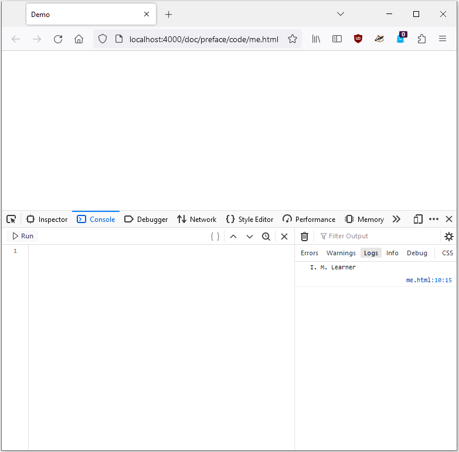
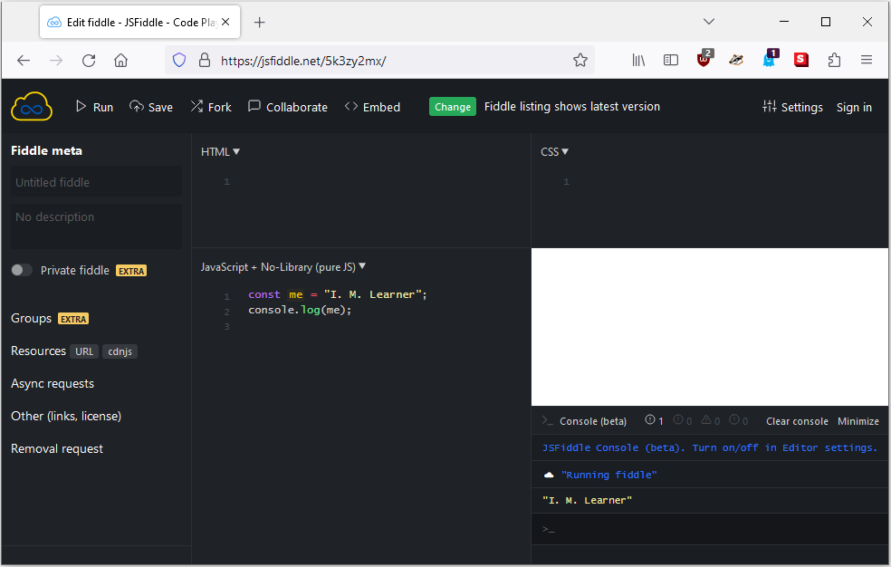

# How to run code examples

The code examples in this book are usually presented as complete scripts. You
should be able to run an example script as is with minimal changes. Each example
script can usually be run in a web browser.

<!-- ================================================================= -->

## Your web browser

You should be able to run each code example in your web browser. A simple way to
run a script in your web browser is to embed the script inside an HTML document.
Consider the following template for an HTML document:

[import, lang="html"](code/template.html)

Suppose you want to run the following script in your browser:

[import](code/me.js)

Insert the JavaScript code at the relevant place in the HTML template. Save the
modified template as an HTML file, e.g. `me.html`, to result in the following
file:

[import, lang="html"](code/me.html)

Open the file [`me.html`](code/me.html) in your web browser, then load the
developer console of your browser. On
[Firefox](https://en.wikipedia.org/wiki/Firefox), pressing the key `F12` loads
the developer console. Refer to the documentation of your web browser for how to
load the developer console corresponding to your browser. The image below shows
the result of the file [`me.html`](code/me.html) running on Firefox, viewed
through the developer console.

<!-- ================================================================= -->

## Online IDE

An online Integrated Development Environment (IDE) is a browser-based IDE that
supports the following features (and perhaps more):

<!-- prettier-ignore -->
- Text editor
- Syntax highlighting for various programming languages
- Run your source code in the browser
- Some form of version control

A popular online IDE for JavaScript is [JSFiddle](https://jsfiddle.net/), which
is used to test most sample scripts in this book. The following image shows the
result of running the script [`me.js`](code/me.js) using JSFiddle.

